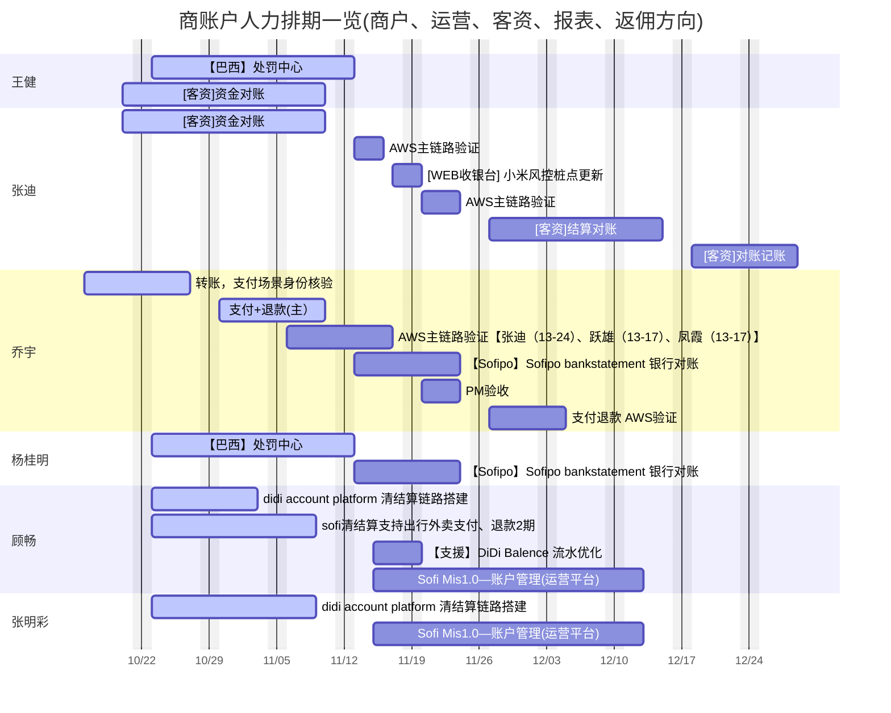
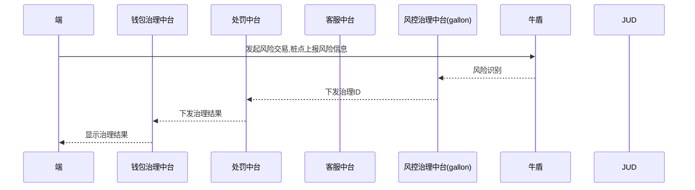
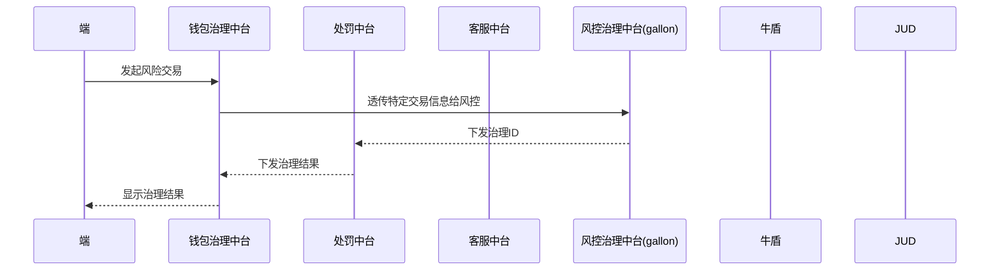
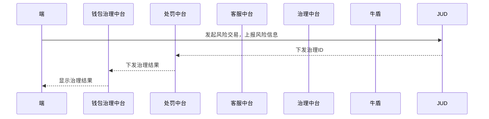
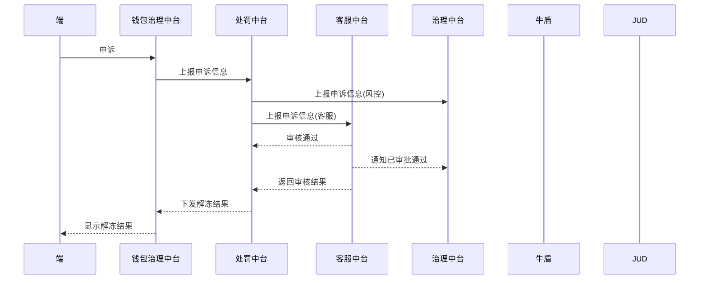
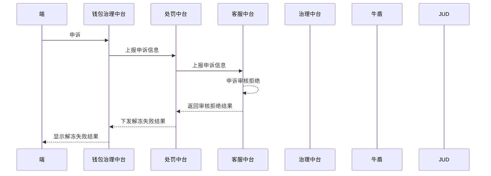

# 今日工作 2023年11月12日
 
# 待完成工作

## 本周核心事项）
- [ ] 新放火周报填写
- [ ] 日志放火需求收集宣贯
- [ ] 后续工作规划

## 日常&提效工作
- [ ] 测试日报发送
- [ ] 自动化测试平台规划
- [ ] 工具平台部署到预发环境
- [ ] 交接内容编写
 

## 项目工作 
- [ ] 巴西处罚中心路测取消？
- [ ] 巴西处罚中心风险跟踪
- P1 [ ] 资金对账进度跟踪
- [ ] Sofipo清结算进度跟踪
- [ ] 商户清结算进度跟踪

## 放火工作
- [x] 现金贷磁盘放火
- [x] 钱包磁盘放火
- [x] 支付中台磁盘放火
- [x] 收银台磁盘放火
- [x] 支付风控磁盘放火
- [ ] 营销磁盘放火
- [x] 商账户磁盘放火
- [x] web磁盘放火
- [ ] P3 metric报警放火能力调研
- [ ] web放火发现9个节点没有配置CPU报警，需要继续放火
- [ ] 信用卡未配置预发节点报警，待后续放火
- [ ] 信贷风控有一个新识别的节点未完成放火（内存、CPU）在正式环境放火
- [ ] 营销方向的放火（磁盘全部，CPU6个，内存1个）
- [ ] 营销放火未触发报警的节点改造跟踪
- [ ] 跟踪营销放火支持情况
- [x] 复盘模板待与佳骐沟通 
- [ ] 待重新注入内存
- [ ] 四个节点：['us01-creditcard_mx-v.workflow-worker.gemini.risk.fintech.didi.com','us01-creditcard_mx-v.workflow-gate.gemini.risk.fintech.didi.com','us01-creditcard_mx-v.fbi-rome-service-us.fbi.risk.fintech.didi.com','us01-v.fbi-rome-gateway-us.fbi.risk.fintech.didi.com']
- [ ] 线上故障放火的复盘模板-监控报警

## 自动化测试平台规划
- RPC接口（Thrift）
- 数据驱动

## 工具平台
- 数据构造低代码化
- 

# 商账户人力排期（11.06-12.01）
本周期20天

|项目|天数|人员|时间周期|
| -- | -- | -- | -- |
|资金对账|7|张迪|6-14|
|小米风控桩点更新|2|张迪|17-20|
|结算对账|5|张迪|1127-1201|
|AWS主链路验证|7|张迪|15-24|
|处罚中心|6|杨桂明|6-13|
|银行对账|11|杨桂明|14-28|
|支付退款|5|乔宇|6-10|
|AWS主链路验证|15|乔宇|1113-1201|
|记账二期|7|顾畅|06-14|
|借出|4|顾畅|15-20|
|清结算链路|7|张明彩|6-14|
|mis2.0|13|张明彩|1115-1201|

#  人力排期

# 处罚中心路测流程
## 冻结（牛盾）

## 冻结（钱包治理中台）

## 冻结（JUD-待确定）

## 解冻成功（客服、风控均可审批，具体流程待确认）

## 申诉失败

多个节点共用数据库，监控直接取数据，无法确认具体节点 ，会有多个节点写一个表